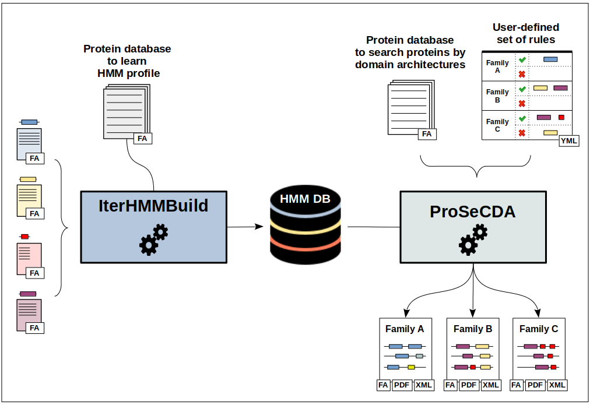

# Welcome to CustomProteinSearch
<figure style="margin-left: auto; margin-right: auto; text-align: center;">
    
</figure>

## Description

CustomProteinSearch is a python package containing two independent but complementary programs whose overall objective is to help users to search for specific proteins of interest based on their domain composition: <b>IterHMMBuild</b>and <b>ProSeCDA</b>.

 

<b>IterHMMBuild</b> is an iterative search method based on the hmmer program, the aim of which is to provide users with a representative HMM protein profile of interest constructed by an iterative enrichment process starting from a small initial set of related protein sequences.

<b>ProSeCDA</b> is a tool that allows to search in a given protein database multiple proteins of interest defined by a user-specified set of domains.

## Documentation and installation
Please see our [documentation](https://nchenche.github.io/cusProSe/) for details about the package and how to [install](https://nchenche.github.io/cusProSe/installation.html) it.

Note: CusProSE is actually not supported on Windows, we'll fix this later.
