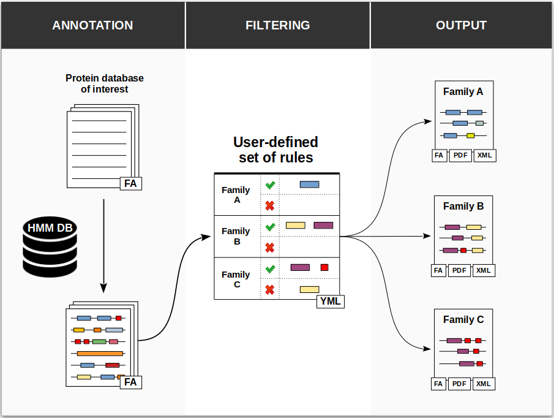

# ProSeCDA Overall procedure
<figure class="fig-prosecda">
    
    <figcaption>
<b>Figure 2: Pipeline overview of ProSeCDA</b> 
    </figcaption>
</figure>

ProSeCDA is a tool that allows to search in a given protein database multiple proteins of interest defined by a user-specified set of domains.

The first step in ProSeCDA is to annotate a protein database of interest with domains from a user-specified HMM profile database. In the next step the annotated proteins are filtered following a set of rules defined by the user. The rule consists to define one or a set of protein families based on the presence and/or absence of domains. All proteins matching thoses rules are then finally accessible in the output. 

## Inputs
ProSeCDA requires three inputs:

* a protein database in a fasta format in which the user wants to search proteins of interest based on their domain architecture.
* an HMM domain profile database used to annotate the input protein database. Any HMM domain profile database can be used as long as it is compatible with hmmersearch. 
* a YAML file containing the rules, that is a set of protein families defined by the presence and/or absence of specific domain(s). The format of the YAML file is described in <a href="./psd_usage.html">Usage guideline</a>. Please note that domains used to define proteins on interest must be present in the HMM domain profile database.

## Annotation
### Selection of matching domains
The annotation step is required to assign domains from the HMM profile database matching sequences in the protein database. The annotation procedure uses hmmsearch to search for each of the HMM domain profile present in the YAML rules file against the protein database of interest. All matching sequences with an E-valuea less than 0.01 (default value) and an expected accuracy per residue of the alignmentb above or equal to 0.6 (default value) are then retrieved.

    

        Note
    

    <ul class="last">
        <li class="note-ref">a Both conditional and independent E-values from hmmer are evaluated</li>
        <li class="note-ref">b Please see the <a href="http://eddylab.org/software/hmmer3/3.1b2/Userguide.pdf">hmmer documentation</a> for more details about the accuracy</li>
    </ul>

### Resolving overlapping domains
To resolve overlapping domainsa, an approach similar to the heaviest weighted clique-finding method described in <a href="https://academic.oup.com/bioinformatics/article/26/6/745/244708">Orengo <i>et al.</i></a> is used. When multiple matching domains are found for a protein sequence and some of those domains overlap, all possible domain architectures defined by a set of non-overlapping domains are identified, with each domain being assigned a score corresponding to -log(E-value). An alternative score is also used in case the E-value associated with a match is equal to 0.0. In that case, the bit score from hmmer is assigned to each domain instead of the -log(E-value) which cannot be computed.
The protein is then assigned the most-likely domain architecture which is defined as the combination of non-overlapping domains that gives the highest total score.

    

        Note
    

    <ul class="last">
        <li class="note-ref">a We consider that two domains are overlapping if at least 40% of the shortest domain sequence overlap with the other domain.</li>
    </ul>

## Filtering
The filtering step searches in all precedently annotated proteins the domain architectures matching those in the set of rules defined by the user. A match with a user-defined family is valid for a protein if its most-likely domain architecture fits the mandatory domains and if no forbidden domains are present. Moreover, if an E-value threshold is specified in the rules for a given mandatory domain, this domain must match with an E-value at least below this threshold.

## Output
The output of ProSeCDA has the following architecture:

<pre><b>prosecda_yyyy-mm-dd_hh-mm-ss/</b>
├── protein_database_filename.domtblout
├── info.log
└── <b>results/</b>
    ├── <b>family_A1/</b>
    │   ├── all_matching_proteins.pdf
    │   ├── protein_id_1.fa
    │   ├── protein_id_1.pdf
    │   ├── protein_id_1.xml
    │   ├── protein_id_2.fa
    │   ├── protein_id_2.pdf
    │   └── protein_id_2.xml
    ├── <b>family_A2/</b>
    │   ├── all_matching_proteins.pdf
    │   ├── protein_id_8.fa
    │   ├── protein_id_8.pdf
    │   ├── protein_id_8.xml
    │   └── ...
    ├── <b>...</b>
</pre>

The table below describes the content of the output directory:

<table class="mytable">
    <tr>
        <th class="t-header">File/Directory name</th>
        <th class="t-header">Description</th>
    </tr>
    <tr>
        <td class="t-data">protein_database_filename.domtblout</td> 
        <td class="t-data">hmmsearch output in domtblout format</td> 
    </tr>
    <tr>
        <td class="t-data">info.log</td> 
        <td class="t-data">Summary log of the computation</td> 
    </tr>
    <tr>
        <td class="t-data">family_A1/</td> 
        <td class="t-data">Subdirectory containing detailed files for proteins matching the rule defining 'family A1'</td> 
    </tr>
    <tr>
        <td class="t-data">all_matching_proteins.pdf</td> 
        <td class="t-data">Figures of all proteins matching the family rule with their most-likely domain architecture</td> 
    </tr>
    <tr>
        <td class="t-data">protein_id_1.fa</td> 
        <td class="t-data">Fasta sequence of the protein</td> 
    </tr>
    <tr>
        <td class="t-data">protein_id_1.pdf</td> 
        <td class="t-data">Figure of the protein with all matching domains 
        </td>
    </tr>
    <tr>
        <td class="t-data">protein_id_1.xml</td> 
        <td class="t-data">XML file describing the protein
        </td>
    </tr>
</table>
