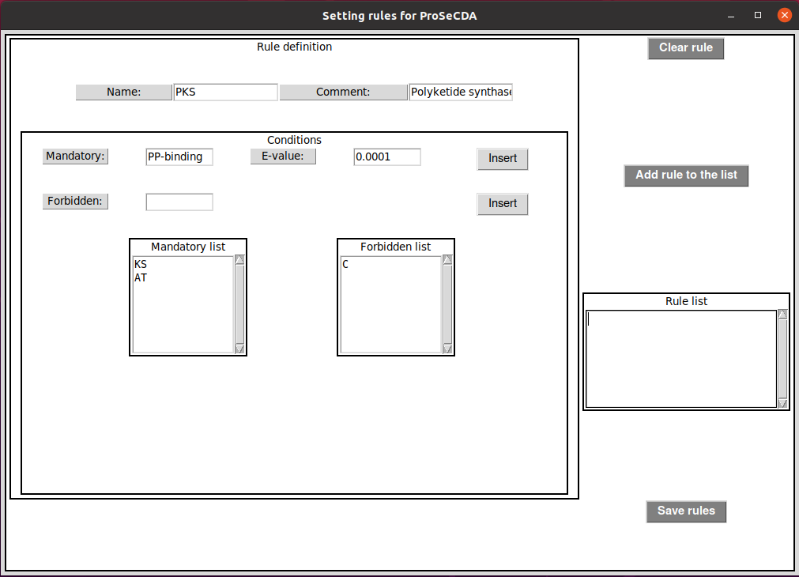
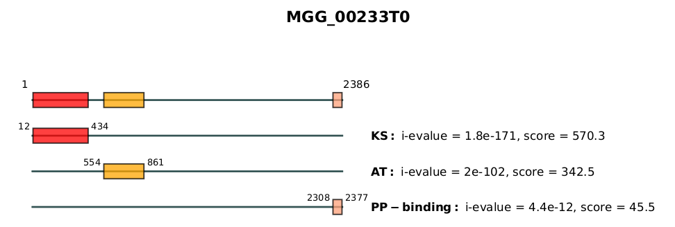
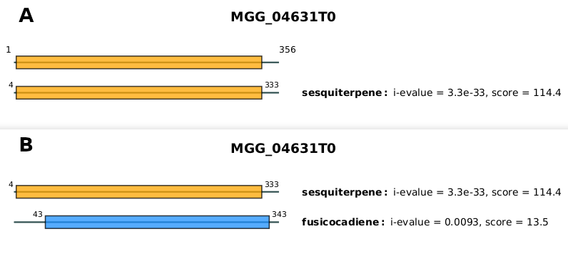

# ProSeCDA usage guideline

<div class="admonition tip">
    <p class="first admonition-title">
        Tip
    </p>
    <p>
    To guide the user, input data files can be found in <code>cusProSe/prosecda/datas/</code>:
    <pre style="line-height: 15px;"><b>cusProSe/prosecda/datas/</b>
      ├── database.hmm
      ├── mgg_70-15_8.fasta
      └── rules.yaml
    </pre>
    <ul>
    Those are the three mandatory files required as inputs to run prosecda:
    <li><code>rules.yaml</code> is a YAML file in which proteins of interest are described based on the presence/absence of specific domains</li>
    <li><code>database.hmm</code> is a customized HMM profile database made of 24 HMM protein domain models</li>
    <li><code>mgg_70-15_8.fasta</code> is the <i>magnaporthe orizae</i> proteome that will be scanned against proteins of interest defined in the YAML rules file</li>
    </ul>
    </p>
</div>

## Quick start example
<div>
The command below will search in the <i>magnaporthe orizae</i> proteome all proteins defined in <code>rules.yaml</code> (the HMM profile database <code>database.hmm</code> is used to find domains of interest matching proteins in the <i>magnaporthe orizae</i> proteome):
```bash
prosecda -proteome mgg_70-15_8.fasta -hmmdb database.hmm -rules rules.yaml
```
</div>

<br>
Help about the usage of ProSeCDA and its parameters can be shown with the following command: `prosecda -h
`:
<pre class="parameters">usage: prosecda [-h] -proteome [PROTEOME] -hmmdb [HMMDB] -rules [RULES] [-out [OUT]] 
                [-cov COV] [-cevalue CEVALUE] [-ievalue IEVALUE] [-score SCORE] [-acc ACC]
                [--nopdf]

Search proteins matching rules.

optional arguments:
  -h, --help            show this help message and exit
  -proteome [PROTEOME]  Proteome file (.fasta)
  -hmmdb [HMMDB]        HMM profile database
  -rules [RULES]        Rules&apos;file (.yaml)
  -out [OUT]            Output directory
  -cov COV              Minimum ratio between the length of the HMM profile stretch that 
                        matches a sequence and the overall length of the HMM profile (0.0)
  -cevalue CEVALUE      HMMER conditional e-value cutoff (0.01)
  -ievalue IEVALUE      HMMER independant e-value cutoff (0.01)
  -score SCORE          HMMER score cutoff (3.0)
  -acc ACC              HMMER mean probability of the alignment accuracy between each residues
                        of the target and the corresponding hmm state (0.6)
  --nopdf               Deactivate the generation of the pdf results (False)
</pre>


## Creating rules
The proteins the user is interested in must be described in a file containing simple rules defining for each protein of interest which domains are mandatory and/or which one are forbidden. An E-value (corresponding to the independent domain E-value from hmmsearch) can also be specified for each mandatory domains. In that case, a mandatory domain must match a sequence with an E-value at least below the one specified. If no E-value is defined for mandatory domains, an E-value of 0.01 is used by default.

#### Editing rules from GUI
The file in which rules are edited must respect a specific syntax in a YAML format. To make it simpler, a Graphical User Interface (GUI) has been implemented. You can access it through the command `create_rules`


<figure class="fig-prosecda">
    
    <figcaption>
<b>Figure 3: Graphical User Interface to edit rules</b> 
    </figcaption>
</figure>

As shown in the above image, a rule can be defined by five different inputs:

* `Name` (required): category/family name the proteins that'll match the rule will be assigned to
* `Comment` (optional): can be used to describe the rule
* `Mandatory` (required): domain name the protein must contain
* `E-value` (optional): minimal E-value the associated domain must match a sequence (0.01 if not specified)
* `Forbidden` (optional): domain name the protein must not contain

Once you have added all your mandatory/forbidden domains describing the domain architecture your proteins of interest must match, click on `Add rule to the list` to validate the rule. You'll see it listed in the `Rule list` panel. Repeat the procedure to create as many rules as you want. 

Once all your desired rules are defined, click on `Save rules` to save them in a YAML file. This YAML file will look like the one described below:

<pre class="parameters">
<font color="#3465A4"><b>PKS:</b></font>
<font color="#3465A4"><b> COMMENT:</b></font> Polyketide Synthase
<font color="#3465A4"><b> CONDITION:</b></font>
<font color="#3465A4"><b>  mandatory:</b></font>
<font color="#3465A4"><b>  - </b></font>KS
<font color="#3465A4"><b>  - </b></font>AT
<font color="#3465A4"><b>  - </b></font>PP-binding, 0.0001
<font color="#3465A4"><b>  forbidden:</b></font>
<font color="#3465A4"><b>  - </b></font>C

<font color="#3465A4"><b>PKS-like:</b></font>
<font color="#3465A4"><b> COMMENT:</b></font> Polyketide Synthase like
<font color="#3465A4"><b> CONDITION:</b></font>
<font color="#3465A4"><b>  mandatory:</b></font>
<font color="#3465A4"><b>  - </b></font>KS
<font color="#3465A4"><b>  - </b></font>AT
<font color="#3465A4"><b>  forbidden:</b></font>

<font color="#3465A4"><b>PKS_type3.0:</b></font>
<font color="#3465A4"><b> COMMENT:</b></font> Polyketide Syntase type III
<font color="#3465A4"><b> CONDITION:</b></font>
<font color="#3465A4"><b>  mandatory:</b></font>
<font color="#3465A4"><b>  - </b></font>CHS_like
<font color="#3465A4"><b>  forbidden:</b></font>

</pre>

#### Updating an existing rule file
If the user wants to update an already existing rule file, he will have to manually edit it. In that case be aware that a YAML file must respect a [specific syntax](https://en.wikipedia.org/wiki/YAML). The simplest way to add new rules in an already existing file might to copy paste an exisitng rule and to adapt its content. Note that all characters in blue in the above YAML file are required, and whitespace indentations must be respected.


## Output of ProSeCDA
#### Overall architecture
The output directory generated from the command run in the [Quick start example](#quick-start-example) will be as described below:

<pre><b>prosecda_year-month-day_hour-min-sec/</b>
├── <b>css/</b>
├── <b>images/</b>
├── index.html
├── info.log
├── <b>js/</b>
├── mgg_70-15_8.domtblout
└── <b>results/</b>
 </pre>

with:
<ul class="myul2">
  <li><code>index.html</code>: an interactive web page allowing to visualize the results (described <a href="#a">here</a>)</li>
  <li><code>css/</code>, <code>js/</code> and <code>images/</code>: folders containing files read by index.html</li>
  <li><code>info.log</code>: summary log of the computation run</li>
  <li><code>mgg_70-15_8.domtblout</code>: output file of hmmsearch</li>
  <li><code>results/</code>: directory containing different output files for rules matching proteins</li>
</ul>

#### Content of the results/ directory
The `results/` directory contains a list of subdirectories, each one corresponding to a user-defined protein family for which match has been found (`DMATS/`, `Ent_kaurene_synthase/` ...):

<pre><b>results/</b>
├── <b>DMATS/</b>
│   ├── all_DMATS.pdf
│   ├── MGG_06540T0.fa
│   ├── MGG_06540T0.pdf
│   ├── MGG_06540T0.xml
│   ├── MGG_10953T0.fa
│   ├── MGG_10953T0.pdf
│   ├── MGG_10953T0.xml
│   ├── MGG_12480T0.fa
│   ├── MGG_12480T0.pdf
│   └── MGG_12480T0.xml
├── <b>Ent_kaurene_synthase/</b>
│   ├── all_Ent_kaurene_synthase.pdf
│   ├── MGG_01949T0.fa
│   ├── MGG_01949T0.pdf
│   ├── MGG_01949T0.xml
|   ...
... 
</pre>

Inside each protein family folder, three files with the related protein ID as the basename (<i>e.g.</i> MGG_06540T0) are generated for each protein matching the user-defined family rule:
<ul class="myul2">
  <li><code>protein_ID.fa</code>: the protein sequence in fasta format</li>
  <li><code>protein_ID.xml</code>: details in XML format about the proteins and its matching domains</li>
  <li><code>protein_ID.pdf</code>: a graphical representation of all of the domains that matched the protein</li>
</ul>

The file whose basename follows the syntax `all_xxx.pdf` (where xxx stands for the family name) is a graphical representation of the most-likely domains architecture for all the proteins that have been found to match the user-defined family rule. Please note that for a given protein the graphical representation in this file will be different from the one found in `protein_ID.pdf`, the latter representing all the domains that have been found to match the protein. Some of those domains might not be visible in the most-likely domain architecture. This will be the case for a domain <i>i</i> that overlaps with a domain <i>j</i> and if any architecture in which domain <i>i</i> is present is not the most-likely architecture, that is the one with the highest score (see <a href="./psd_introduction.html#resolving-overlapping-domains">here</a> for details about how the score is assigned).

## Illustration of the output files

#### The all_xxx.pdf file
The file whose basename follows the syntax `all_xxx.pdf` is a multipage pdf file containing graphical representations of the most-likely domain architecture of all the proteins that have been found to match the user-defined family rule.

An example of the first page of `all_PKS.pdf` is shown below:

<figure >
    
</figure>

The first line of the figure represents all domains composing the most-likely domain architecture found for the protein MGG_00233T0. The next lines represent details information about each domain, namely its amino acid positions, name, independant e-value (i-evalue) and its score.

#### The protein_ID.pdf file
The graphical representation found for a given protein in the file `protein_ID.pdf` does not show any domain architecture; instead it represents all the domains that matched the protein sequence during the [annotation step](psd_introduction.html#annotation). The main function of this file is to keep track of domains that may have not been retained to be part of the most-likely architecture. It thus provides the user a way to check the validity for a protein to really belong to the assigned protein family.

To illustrate that point, let's compare both graphical representations for the protein MGG_04631T0 that has been assigned to the Sesquiterp_synthase family:

<figure>
    
    <figcaption>
    <b>Figure 4:</b> Comparison of the graphical representations of the protein MGG_04631T0 found in (<b>A</b>) <code>all_Sesquiterp_synthase.pdf</code> and (<b>B</b>) <code>MGG_04631T0.pdf</code>.
    </figcaption>
</figure>

The figure 4A shows the most-likely domain architecture assigned to the protein MGG_04631T0 (found in <code>all_Sesquiterp_synthase.pdf</code>) which is composed of only one domain: the <i>sesquiterpene</i> domain. 

The figure 4B shows all the domains that matched the protein sequence during the annotation step. We can see in this representation that both the <i>sesquiterpene</i> domain and the <i>fusicocadiene</i> domain matched the protein sequence. Only the sesquiterpene domain has been retained in the most-likely domain architecture based on its most favorable i-evalue and thus made the protein assigned as an Sesquiterp_synthase.

### The protein_ID.xml file
The protein_ID.xml file contains the main information about the protein. An example of the content of this xml file is shown below for the protein MGG_04631T0:

```xml
<protein>
  <id>MGG_04631T0</id>
  <sequence>MADRTCVTLPDMFRGFIVQEPKVNKHYEAVKPVSEKWLARICAFSPMMQKRVGACDFSYFCSIAAPEAPIHKLRTMCDWGNWVFPFDDMFDSGDLRSDLIVTRHVLDSLLADMKGHKFRGLKIPVVLAHDDIYRRLSEVETKNPSISGVQRRFARAMELYALGVAQHVQDFTESGLPCPQEMLETRRLSVGVAPLYHLVEYAHSIRLPDEVFEDPAIQTLERLGADMVIMSNDMLSYQKEEASTNNEGCPFNMVAACRMSGQSAQEAFDTVGALLEESYYEWEETMRQVPARGGDVERDVQRYIKGIQDVVQANITWSFRSKRYLGVHAPEVRRTKKFDVMTHPPYLDKDMAELR</sequence>
  <sequence_length>356</sequence_length>
  <class_name>Sesquiterp_synthase</class_name>
  <most_likely_architecture>
    <domain name="sesquiterpene">
      <c-evalue>2e-36</c-evalue>
      <i-evalue>3.3e-33</i-evalue>
      <score>114.4</score>
      <start>4</start>
      <end>333</end>
      <domain_length>330</domain_length>
    </domain>
  </most_likely_architecture>
  <other_matching_domains>
    <domain name="fusicocadiene">
      <c-evalue>7.9e-06</c-evalue>
      <i-evalue>0.0093</i-evalue>
      <score>13.5</score>
      <start>43</start>
      <end>343</end>
      <domain_length>301</domain_length>
    </domain>
  </other_matching_domains>
</protein>
```

Please note that if domains matched the protein sequence during the annotation step but don't belong to the most-likely architecture, those domains will be listed in the xml file under the tag <code><other_matching_domains\></code>.